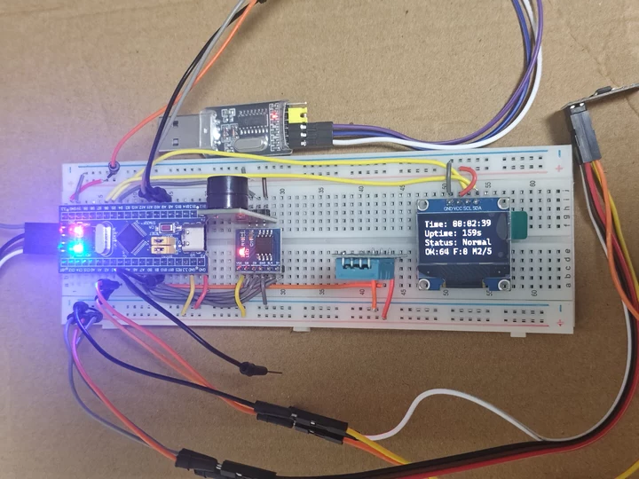
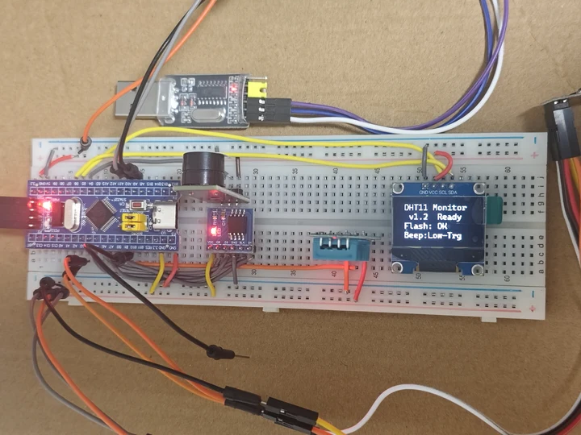
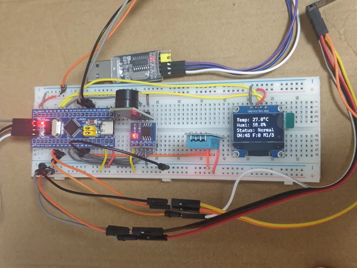

# 温湿度监测仪 v1.2


-orange.svg)

基于 **STM32F103C8T6** 的温湿度监测系统：采集 → 显示 → 存储 → 报警 → 无线推送，全链路打通。
**纯寄存器裸机开发，不依赖 HAL 库**，所有外设（GPIO / 定时器 / 串口 / SPI / 软件 I2C）均由直接读写寄存器实现。

- 主控：STM32F103C8T6（Cortex-M3），主频 64 MHz
- 固件体积：Flash **17.0 KB**、RAM **1.9 KB**（`text 17400 / data 8 / bss 1920`）
- 代码规模：`Src/main.c` 3365 行（含大量原理注释）



---

## 1. 这个项目解决什么问题

普通的温湿度计只能"看一眼当前读数"，而这个系统解决的是**四个更实际的痛点**：

| 痛点 | 本项目的做法 |
|---|---|
| 数值跳动，看不准 | 5 次采样做**滑动平均**滤波，读数不再来回抖 |
| 想知道"刚才一小时是不是一直这么热" | 每分钟把一条记录写进 **W25Q64 SPI Flash（8 MB）**，**掉电不丢**，可在 OLED 上翻页回看 |
| 人不在现场就不知道超没超限 | 温度 > 30.0 °C 或湿度 > 80.0 % 时，**LED 快闪 + 蜂鸣器鸣响**本地报警 |
| 要凑到屏幕前才能看 | ESP-01S **自建 WiFi 热点 + TCP 服务器**，手机连上就能每 2 秒收到一行数据，不用路由器、不用外网 |

**它不依赖任何云平台和路由器**——板子自己发热点，手机直连即可，适合宿舍、实验室、温室、机房等没有现成网络基础设施的场景。

---

## 2. 主要功能

| # | 功能 | 实现要点 |
|---|---|---|
| 1 | **DHT11 采集** | PB0 单总线，主机拉低 >18 ms 起始；40 位数据按"高电平时长"解码（26~28 µs = 0，70 µs = 1）；**校验和验证** |
| 2 | **软件滤波** | 最近 5 次有效采样滑动平均，抑制跳动 |
| 3 | **OLED 显示** | SSD1306 128×64，软件模拟 I2C（PB6=SCL，PB7=SDA），**5 个画面**按键切换 |
| 4 | **历史记录** | W25Q64（硬件 SPI1）掉电存储，**每分钟 1 条**，3 字节/条，双扇区乒乓写入 |
| 5 | **极值统计** | 记录开机以来的温度/湿度最大值与最小值 |
| 6 | **超限报警** | 超阈值时 LED 由 1 Hz 转 4 Hz 快闪，蜂鸣器断续鸣响 |
| 7 | **无线推送** | ESP-01S 自建热点 `ESP_TEMP`，TCP 服务器端口 8080，每 2 秒推一帧给手机 |
| 8 | **串口调试** | USART1 @115200 输出完整日志（原始数据、滤波值、报警状态、AT 指令往返） |
| 9 | **上电自检** | 蜂鸣器短鸣、I2C 总线扫描、Flash JEDEC 校验，故障通过 **LED 闪码**报出（没接串口也能判断） |
| 10 | **无 RTC 计时** | 无外接时钟芯片，用 **TIM2 硬件定时器 1 ms 中断**做时基，开机计时 00:00:00 |

### 五个显示画面（短按 K1 切换，长按 1 秒回画面 0）

| 画面 | 内容 |
|---|---|
| 0 温湿度 | `Temp` / `Humi` / `Status` / 采样统计 |
| 1 时间 | 开机计时 `时:分:秒` + 运行总秒数 |
| 2 极值 | `Tmax` / `Tmin` / `Hmax` / `Hmin` |
| 3 历史 | 从 Flash 读出，**每页 3 条**，短按翻页（此画面需长按才能退出） |
| 4 WiFi | 热点状态 / SSID / IP / 客户端数 / 已推送帧数 |

### LED 状态含义（不看屏幕也能判断运行状态）

| 现象 | 含义 |
|---|---|
| 1 Hz 慢闪 | 正常，未超限 |
| 4 Hz 快闪 | **报警**：温度或湿度超阈值 |
| 8 Hz 超快闪 | DHT11 读取失败 |
| 上电闪 2 次 | I2C SDA 自检通过 |
| 上电闪 1 次 | I2C SDA 自检失败（线没接上） |
| 上电闪 3 次 | W25Q64 识别成功（`JEDEC = 0xEF4017`） |

---

## 3. 安装方法

### 3.1 硬件清单

| 器件 | 规格 | 数量 |
|---|---|---|
| 主控板 | STM32F103C8T6 最小系统板（"蓝丸"） | 1 |
| 温湿度传感器 | DHT11 | 1 |
| 显示屏 | SSD1306 OLED 128×64，I2C 接口 | 1 |
| Flash | W25Q64 模块（8 MB / 64 Mbit） | 1 |
| WiFi 模块 | ESP-01S | 1 |
| 蜂鸣器 | 3 针**有源**蜂鸣器模块（本项目为低电平触发） | 1 |
| 按键 | 轻触按键 | 1 |
| 下载器 | ST-Link V2 | 1 |
| 串口模块 | CH340 USB 转串口（调试用） | 1 |

### 3.2 接线表

> ⚠️ **接线前务必逐脚核对丝印**。3 针器件的引脚顺序没有统一标准（有 `VCC-IO-GND`、`GND-VCC-IO`、`VCC-GND-IO` 多种排法）。
> **电源反接的模块通常不会烧毁，而是"不烧不响"的静默失效**，现象看起来极像软件故障，排查成本很高。
> 建议统一颜色约定：**VCC 用红线，GND 用黑/蓝线**。

| 器件 | 引脚 | 接到 STM32 | 说明 |
|---|---|---|---|
| **DHT11** | VCC / GND | 3.3 V / GND | |
| | DATA | **PB0** | 单总线 |
| **OLED** | VCC / GND | 3.3 V / GND | |
| | SCL / SDA | **PB6 / PB7** | 软件 I2C，地址 `0x78` |
| **W25Q64** | VCC / GND | 3.3 V / GND | **不耐 5 V** |
| | CS / CLK / DO / DI | **PA4 / PA5 / PA6 / PA7** | SPI1；DO→MISO，DI→MOSI |
| **蜂鸣器** | VCC / GND | 3.3 V / GND | 见上方反接警告 |
| | IO | **PB5** | 低电平触发（`BEEP_ACTIVE_HIGH = 0`） |
| **按键 K1** | 一端 / 另一端 | **PB1** / GND | 内部上拉，无需外接电阻 |
| **LED** | 板载 | **PC13** | 直接使用板上 LED |
| **CH340** | RXD / TXD | **PA9 / PA10** | USART1 @115200 |
| **ESP-01S** | VCC / GND | 3.3 V / GND | **峰值 300 mA+**，建议就近并联 470 µF 电容 |
| | CH_PD（即 EN） | **3.3 V** | **不接模块毫无反应** |
| | TXD / RXD | **PA3 / PA2** | USART2，**收发交叉** |
| | RST、GPIO0、GPIO2 | 悬空 | GPIO0 拉低会进下载模式 |

> ESP-01S 供电建议取自 STM32 板载 3.3 V（AMS1117，约 500–800 mA），**不要**用 ST-Link 的 3.3 V（仅约 100 mA，会反复重启）。
> 注意很多面包板的**正极轨在中间是断开的**，跨在断口两侧等于没供电。

### 3.3 编译

#### 方式 A：STM32CubeIDE（推荐初学者）

1. 打开 STM32CubeIDE → `File → Import → Existing Projects into Workspace`
2. 选择本仓库目录，导入后直接 `Build`
3. 点击 `Run / Debug` 即可通过 ST-Link 烧录

#### 方式 B：命令行（arm-none-eabi-gcc）

需先安装 [GNU Arm Embedded Toolchain](https://developer.arm.com/downloads/-/gnu-rm) 并加入 `PATH`：

```bash
# 编译（Cortex-M3、无 HAL、-Wall -Wextra 零警告）
arm-none-eabi-gcc -mcpu=cortex-m3 -mthumb -std=c11 -Wall -Wextra -O1 -g \
  -ffunction-sections -fdata-sections -DSTM32F103xB \
  -c Src/main.c      -o main.o
arm-none-eabi-gcc -mcpu=cortex-m3 -mthumb -std=c11 -O1 -g \
  -c Src/syscalls.c  -o syscalls.o
arm-none-eabi-gcc -mcpu=cortex-m3 -mthumb -std=c11 -O1 -g \
  -c Src/sysmem.c    -o sysmem.o
arm-none-eabi-gcc -mcpu=cortex-m3 -mthumb \
  -c Startup/startup_stm32f103c8tx.s -o startup.o

# 链接
arm-none-eabi-gcc -mcpu=cortex-m3 -mthumb \
  -T STM32F103C8TX_FLASH.ld \
  -Wl,-Map=fw.map -Wl,--gc-sections \
  -specs=nano.specs -specs=nosys.specs \
  main.o syscalls.o sysmem.o startup.o -o fw.elf

# 生成烧录用 hex
arm-none-eabi-objcopy -O ihex fw.elf fw.hex
```

> 若使用 STM32CubeIDE 自带工具链，gcc 位于
> `<CubeIDE安装目录>/plugins/com.st.stm32cube.ide.mcu.externaltools.gnu-tools-for-stm32.*/tools/bin/`

### 3.4 烧录

```bash
# STM32CubeProgrammer CLI（ST-Link）
STM32_Programmer_CLI -c port=SWD -w fw.hex -v -rst
```

烧录器只接 **SWDIO / SWCLK / GND** 三根线即可（不要同时接 3.3 V，避免两个电源并联）。

---

## 4. 使用方法

### 4.1 上电

1. 按上表接好线，ST-Link 与 CH340 接好
2. 上电后蜂鸣器**短鸣 200 ms** 自检；板载 LED 长亮 1.5 s 后进入闪码自检
3. OLED 显示 `DHT11 Monitor v1.2 Ready`，随后进入画面 0

### 4.2 按键操作

| 操作 | 效果 |
|---|---|
| **短按 K1** | 切换画面（0→1→2→3→4→0）；在画面 3（历史）内则是**翻页** |
| **长按 K1（≥1 秒）** | 直接回到画面 0（从历史画面"脱身"的唯一方式） |

按键时 LED 会闪一下（短按闪 1 次、长按闪 2 次）作为反馈。

### 4.3 手机接收无线数据

1. 手机 WiFi 连接热点 **`ESP_TEMP`**，密码 **`12345678`**
   - 提示"无法访问互联网"时选择**仍然连接**（热点本就没有外网，正常）
2. 打开任意支持 **TCP Client** 的网络调试 APP
3. 目标地址 **`192.168.4.1`**，端口 **`8080`**，点连接
4. 每 2 秒收到一行数据：

```
T=31.6C H=45.0% #106 A=1
```

| 字段 | 含义 |
|---|---|
| `T=31.6C` | 滤波后温度（°C） |
| `H=45.0%` | 滤波后湿度（%） |
| `#106` | Flash 中已存的历史记录条数 |
| `A=1` | 报警标志：1=超限，0=正常 |

> ⚠️ 手机 APP 需要的是 **TCP Client（客户端）** 模式；若只有 Server（服务端/"监听中"）模式，两者都在等待对方，永远连不上。

### 4.4 演示流程

把手捂在 DHT11 上几秒，可同时观察到三个现象：

- OLED 温度上升、`Status` 变为 `ALARM`
- LED 由慢闪转**快闪**，蜂鸣器开始断续鸣响
- 手机收到的数据中 `A=0` 变为 `A=1`
- 按 K1 切到画面 2，可看到 `Tmax` / `Hmax` 被刷新（且不会回落）

---

## 5. 输入输出示例

### 5.1 输入

| 输入 | 来源 | 频率 |
|---|---|---|
| 温度 / 湿度 | DHT11（PB0 单总线） | 每 2 秒 |
| 按键 | K1（PB1） | 随时 |
| 客户端 TCP 连接 | 手机经 WiFi | 随时 |

### 5.2 输出一：串口日志（USART1，115200 8N1）

以下为**真机上电后实际抓取**的输出：

```
=== 温湿度监测仪 v1.2（DHT11 + OLED + W25Q64 + 蜂鸣器 + ESP8266 WiFi）===
CPU 主频: 64 MHz
[自检] 蜂鸣器短鸣 200ms（配置为低电平触发）：若此后一直长鸣不停，说明模块是另一种触发极性
[SDA自检] 通过（线上有上拉，接线正常）
[I2C总线] 空闲电平 SCL(PB6)=1 SDA(PB7)=1  (正常两个都应为 1)
[I2C总线] 扫描到 1 个器件: 0x78
[W25Q64] JEDEC ID = 0xEF4017
[W25Q64] 识别成功（Winbond，容量 4MB 量级）
[记录] 已有 106 条历史记录，本次从扇区 A 继续写入
[I2C复核] 进入 OLED_Init 前再扫一次: 1 个器件: 0x78
[OLED] 初始化成功，地址 0x78
[ESP] 开始配置：AP 模式 + 热点 + TCP 服务器
[ESP>] ATE0
[ESP<]   OK
[ESP>] AT+CWMODE=2
[ESP<]   OK
[ESP>] AT+CWSAP="ESP_TEMP","12345678",5,3
[ESP<]   OK
[ESP>] AT+CIPMUX=1
[ESP<]   OK
[ESP>] AT+CIPSERVER=1,8080
[ESP<] no change    OK
[ESP>] AT+CIFSR
[ESP<] +CIFSR:APIP,"192.168.4.1"  +CIFSR:APMAC,"xx:xx:xx:xx:xx:xx"    OK
[ESP] 就绪：热点 SSID=ESP_TEMP  密码=12345678
[ESP] 初始化成功：热点 ESP_TEMP 已建立
--- 开始采集：每 2 秒一次，每 1 分钟存一条历史 ---
--- 按 K1(PB1) 切换画面（共 5 个），历史画面内再按则翻页 ---
[DHT11] raw: 2D 00 1F 06 52 | Temp 31.6C  Humi 45.0% | 滤波后 31.6C 45.0% | [报警]
[DHT11] raw: 2D 00 1F 07 53 | Temp 31.7C  Humi 45.0% | 滤波后 31.6C 45.0% | [报警]
```

`raw: 2D 00 1F 06 52` 是 DHT11 的 5 字节原始帧：湿度整数 `0x2D`=45、温度整数 `0x1F`=31、温度小数 `0x06`=0.6；
校验和 `0x2D + 0x00 + 0x1F + 0x06 = 0x52` ✓ 与第 5 字节一致。

### 5.3 输出二：手机 TCP 收到的数据

```
T=31.6C H=45.0% #106 A=1
T=31.6C H=45.0% #106 A=1
T=31.7C H=45.0% #106 A=1
```

模块侧对应的 AT 握手（实测 12 次，`>` 提示符耗时稳定在 208~219 ms）：

```
AT+CIPSEND=0,25        ->  >
T=31.6C H=45.0% #106 A=1
                       ->  Recv 25 bytes / SEND OK
```

### 5.4 输出三：OLED 画面（128×64，每屏 4 行）

```
┌────────────────┐  ┌────────────────┐  ┌────────────────┐
│ Temp: 31.6°C   │  │ Time: 00:12:34 │  │ Tmax: 31.7°C   │
│ Humi: 45.0%    │  │ Uptime: 754s   │  │ Tmin: 29.1°C   │
│ Status: ALARM  │  │ Status: Normal │  │ Hmax: 52.0%    │
│ OK:123 F:0 M1/5│  │ OK:123 F:0 M2/5│  │ Hmin: 44.0%    │
└────────────────┘  └────────────────┘  └────────────────┘
   画面 0 温湿度        画面 1 时间           画面 2 极值

┌────────────────┐  ┌────────────────┐
│ H1/36 N=106    │  │ WiFi: AP OK    │
│ 104 31.5 45.0  │  │ SSID:ESP_TEMP  │
│ 105 31.6 45.0  │  │ IP: 192.168.4.1│
│ 106 31.6 45.0  │  │ Client:1 TX:106│
└────────────────┘  └────────────────┘
   画面 3 历史          画面 4 WiFi
```

画面 3 每行格式为 `序号 温度 湿度`；因每分钟存一条，**序号差即分钟差**（往前数 5 行 ≈ 5 分钟前）。
画面 4 的 `Client:1` 表示有手机已连接，`TX:` 是已成功推送的帧数。

### 5.5 输出四：蜂鸣器与 LED

| 条件 | 蜂鸣器 | LED |
|---|---|---|
| 上电自检 | 短鸣 200 ms | 长亮 1.5 s |
| 正常未超限 | 静默 | 1 Hz 慢闪 |
| 超限（>30.0 °C 或 >80.0 %） | 断续鸣响（响 200 ms / 停 800 ms） | 4 Hz 快闪 |
| DHT11 读取失败 | 静默 | 8 Hz 超快闪 |

### 5.6 实物照片

以下三张均为**真机实拍**（非示意图），OLED 上的文字可直接与 5.4 的画面定义对照：

| 上电自检 | 实时读数 | 运行状态 |
|---|---|---|
|  |  |  |
| `DHT11 Monitor` `v1.2 Ready` `Flash: OK` `Beep:Low-Trg` | `Temp: 27.8°C` `Humi: 58.8%` `Status: Normal` `OK:45 F:0 M2/5` | `Time: 00:02:39` `Uptime: 159s` `Status: Normal` `OK:64 F:0 M2/5` |

三张照片对应三种状态：

- **上电自检**：OLED 报出 `Flash: OK`（W25Q64 的 JEDEC 校验通过）与 `Beep:Low-Trg`（蜂鸣器按低电平触发配置）
- **实时读数**：滑动平均后的温湿度 + `Status: Normal`；末行 `OK:45 F:0 M2/5` 含义为「成功采样 45 次 / 失败 0 次 / 当前显示画面 2，共 5 个画面」
- **运行状态**：`Time` 为开机计时，`Uptime` 为最近一次成功采集距今的秒数

整机全部搭在面包板上：STM32F103C8T6 最小系统板、SSD1306 OLED、DHT11、W25Q64、3 针蜂鸣器、ESP-01S 与 CH340 共地供电，**未使用任何外部路由器**——热点由 ESP-01S 自行发出。

---

## 6. 项目结构

```
温湿度监测仪/
├── README.md                     本文件
├── LICENSE                       MIT 许可证
├── STM32F103C8TX_FLASH.ld        链接脚本（Flash/RAM 布局）
├── docs/
│   └── images/                   实物照片（见 5.6 节）
├── Src/
│   ├── main.c                    全部应用代码（3365 行，含详细原理注释）
│   ├── syscalls.c                系统调用桩（newlib 依赖）
│   └── sysmem.c                  堆内存管理桩
└── Startup/
    └── startup_stm32f103c8tx.s   启动文件（向量表 + 复位入口）
```

`main.c` 按章节组织，便于阅读：

| 章节 | 内容 |
|---|---|
| 1–3 | 寄存器地址定义、系统时钟（HSI/PLL→64 MHz）、SysTick 微秒延时 |
| 4–5 | 软件 I2C 与 SSD1306 OLED 驱动（含 8×16 字库取模原理） |
| 6–8 | TIM2 1 ms 时基、按键扫描（消抖 + 长短按）、DHT11 单总线 |
| 9–11 | SPI1、W25Q64 驱动、历史记录读写（双扇区乒乓） |
| 12–14 | 蜂鸣器、五个显示画面、USART1 调试串口 |
| 15 | ESP-01S 驱动（USART2 + AT 指令 + 收包中断 + 断线重连） |
| 16 | 主函数与状态机 |

---

## 7. 几个值得说明的技术决策

| 决策 | 原因 |
|---|---|
| **不用 HAL，直接写寄存器** | 每一行都对应参考手册的一个 bit，便于理解外设真实工作方式；固件仅 17 KB |
| **用 HSI 内部时钟而非外部晶振** | HSI 8 MHz / 2 → PLL ×16 = 64 MHz，不依赖外部晶振是否起振，程序更"皮实" |
| **时基用 TIM2 硬件中断，不用延时累加** | 软件延时的每次调用都有指令开销，累加一万次误差明显；定时器中断与程序在做什么无关 |
| **Flash 用双扇区乒乓写入** | Flash 只能把 1 写成 0，改写前必须整扇区擦除。两个扇区轮流用，每个扇区"用满一次"才擦一次，寿命消耗极慢 |
| **USART2 接收用中断而非轮询** | 115200 下字节间隔仅 87 µs，而主循环每 1 ms 才轮询一次，**慢十几倍**会导致溢出丢字节，只能收到每帧第一个字符 |
| **ESP 自建热点而非连路由器** | 不依赖外部网络，演示时随手就能连；缺点是热点无外网，手机/电脑会提示"无法访问互联网" |

---

## 8. 可配置参数

集中在 `Src/main.c` 中，修改后重新编译即可：

| 宏 | 默认值 | 含义 |
|---|---|---|
| `TEMP_ALARM_X10` | `300` | 温度报警阈值 30.0 °C（×10 存储） |
| `HUMI_ALARM_X10` | `800` | 湿度报警阈值 80.0 % |
| `FILTER_N` | `5` | 滑动平均的采样个数 |
| `BEEP_ACTIVE_HIGH` | `0` | 蜂鸣器触发极性：`0`=低电平触发，`1`=高电平触发 |
| `HIST_PER_PAGE` | `3` | 历史画面每页显示条数 |
| `ESP_AP_SSID` / `ESP_AP_PWD` | `ESP_TEMP` / `12345678` | 热点名称与密码 |
| `ESP_TCP_PORT` | `8080` | TCP 服务器端口 |
| `ESP_LOG_FRAMES` | `0` | 改为 `1` 可在串口打印每帧 AT 往返（调试用，会很吵） |
| `I2C_SWAP_DIAG` | `0` | 改为 `1` 开启 SCL/SDA 接反判别（排障用） |

---

## 9. 常见故障速查

| 现象 | 最常见原因 |
|---|---|
| OLED 不亮 | SCL/SDA 接反；模块 VCC 未真正量到 3.3 V；杜邦线断线 |
| OLED 花屏/错位 | 行号换算错（每行字符占 **2 个 page**，只能用 0/2/4/6） |
| 串口全是乱码 | 波特率不是 115200；或 `BRR` 计算多乘了 16（正确公式：`BRR = fCK / baud`） |
| Flash 读出 `0x000000` / `0xFFFFFF` | DO/DI 接反；或 CS 未接 PA4 |
| ESP 完全无响应 | `CH_PD`(EN) 未接 3.3 V；TXD/RXD 未交叉；供电不足 |
| 手机连上热点但收不到数据 | APP 用了 **TCP Server** 模式，应改为 **TCP Client** |
| 蜂鸣器从来不响 | **VCC/GND 接反**（反接通常不烧，只是不响）；或 IO 未接到 PB5 |
| 蜂鸣器一直长鸣 | 触发极性配反，把 `BEEP_ACTIVE_HIGH` 改为 `1` |
| 按键卡在历史画面出不来 | 该画面短按是翻页，需**长按 1 秒**返回 |

---

## 10. 已验证环境

| 项目 | 实测值 |
|---|---|
| 主控 | STM32F103C8T6，64 MHz |
| 编译器 | arm-none-eabi-gcc 14.3（`-Wall -Wextra` 零警告） |
| ESP-01S 固件 | AT 1.1.0.0（May 11 2016）/ SDK 1.5.4，波特率 115200 |
| OLED | SSD1306，I2C 地址 `0x78` |
| Flash | W25Q64，`JEDEC = 0xEF4017` |
| 供电压测 | 200 次连续 AT 全部成功，零重启 |
| 推送时延 | `>` 提示符 208~219 ms（12 次采样，抖动 11 ms） |

---

## 11. 许可证

本项目采用 **MIT 许可证**，详见 [`LICENSE`](LICENSE)。

- 版权人：`Copyright (c) 2026 Brandon Feng`（如需改成别的署名，直接编辑 `LICENSE` 第一行）
- 允许商用、修改、再发布，**唯一要求**是保留版权声明与许可声明
- 代码按"原样"提供，不含任何明示或默示担保
